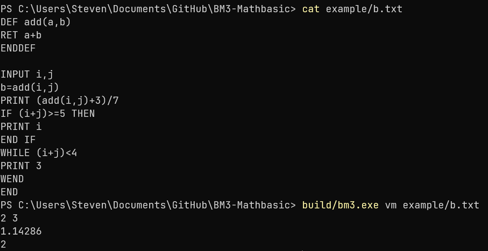
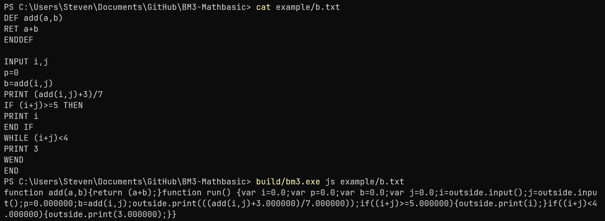
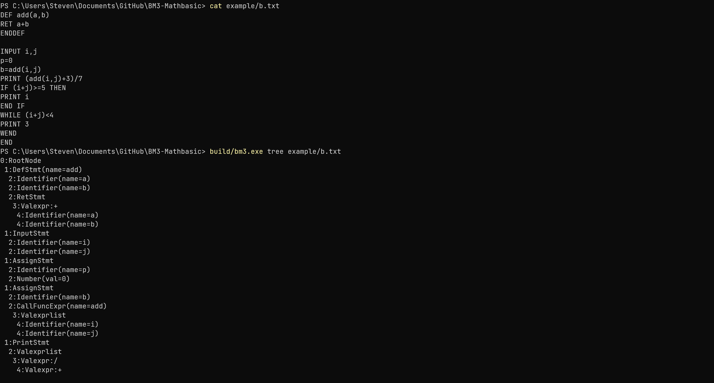
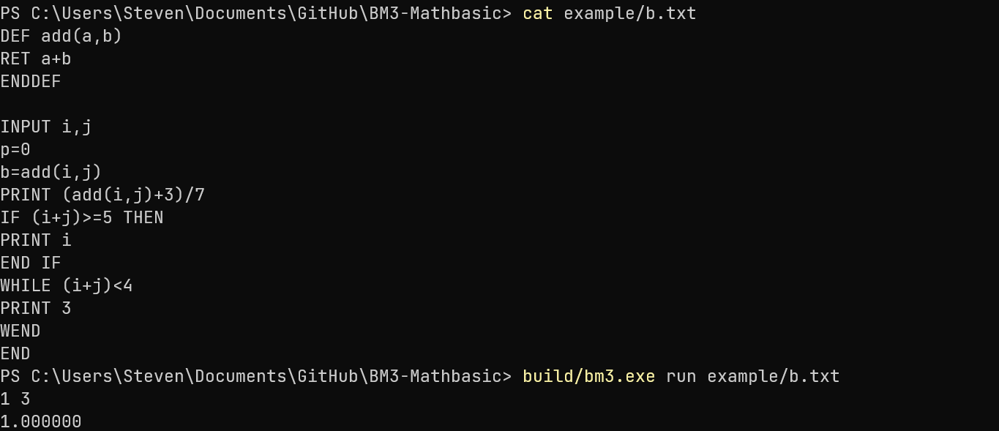

# BM3-Mathbasic : 一个简易的解释器

## 1 系统功能以及程序结构

该解释器由语法树生成、语法树处理以及栈式虚拟机三个部分组成。

### 1.1 语法树生成

语法树生成主要由以下文件实现：

```
include/lex/lexer.h
include/parse/parse.h
src/lex/lexer.cc
src/parse/parse.cc
```

其中 lexer.h 与 lexer.cc 负责词法分析，parse.h 与 parse.cc 负责语法分析。

#### 1.1.1 词法分析

词法分析采用有限状态自动机的方法，将输入的文本分解为记号流，方便进一步的语法分析。

Lexer类为词法分析工具类，内含4个函数：LexIdentifier LexNumber LexOper Lex，其中Lex函数为词法分析的函数，另外三个函数用于分析变量名、数字以及运算符。

该编程语言有以下记号类型，定义在TokenType枚举内：

```
enum TokenType {
    IDENTIFIER,
    NUMBER,
    GREATEREQUAL,
    GREATER,
    LESSEQUAL,
    LESS,
    NOEQUAL,
    EQUAL,
    ASSIGN,
    ADD,
    SUB,
    MUL,
    DIV,
    POW,
    LBRACKET,
    RBRACKET,
    COMMA,
    NEWLINE
  };
```

在词法分析的时候会自动忽略程序中多余的空格。

#### 1.1.2 语法分析

该程序采用LL(1)文法对目标语言进行描述，并采用递归下降的算法进行语法分析。

目标语言的完整上下文无关文法为：

```
RootNode -> Stmts
Stmts -> Stmt NEWLINE Stmts | Stmt
Stmt -> IfStmt
      |WhileStmt
      |DoLoopStmt
      |InputStmt
      |PrintStmt
      |RetStmt
      |DefStmt
      |EndStmt
      |AssignStmt
IfStmt -> IF CondExpr THEN NEWLINE Stmts ElseStmt
         |IF CondExpr THEN NEWLINE Stmts
WhileStmt -> WHILE CondExpr NEWLINE Stmts WEND
DoLoopStmt -> DO NEWLINE Stmts LOOP UNTIL CondExpr
InputStmt -> INPUT IdentifierList
PrintStmt -> PRINT ValExprList
RetStmt -> RET ValExpr
EndStmt -> END
DefStmt -> DEF Identifier ( IdentifierList ) Stmts ENDDEF
AssignStmt -> Identifier = ValExpr
CondExpr -> ValExpr > ValExpr
           |ValExpr < ValExpr
           |ValExpr <= ValExpr
           |ValExpr >= ValExpr
           |ValExpr == ValExpr
           |ValExpr <> ValExpr
ValExpr -> AddExpr + MulExpr | + MulExpr | - MulExpr
AddExpr -> AddExpr + MulExpr | MulExpr
MulExpr -> MulExpr + PowExpr | PowExpr
PowExpr -> PrimaryExpr + PowExpr | PrimaryExpr
PrimaryExpr -> IdExpr
              |Number
              |ParenExpr
IdExpr -> Id CallFuncExpr
         |Id ε
CallFuncExpr -> ( ValExprList )
ParenExpr -> ( ValExpr )
ValExprList -> ValExpr ValExprList | ValExpr ε
IdentifierList -> Identifier IdentifierList | Identifier ε
Id -> Identifier
```

需要注意的是并非每个文法的非终结符都有语法树对应的类型。如IdentifierList的实现使用的是std::list\<Identifier\>而非一个单独的类。

parse.h文件为Parse类的定义，以及实现用于作用域控制、函数调用检查的辅助类与函数。

递归下降分析所使用的函数定义在Parse类中：

```
Ptr<Identifier> ParseIdentifier();
Ptr<Number> ParseNumber();
Ptr<Valexpr> ParseParenExpr();
Ptr<Valexpr> ParseIdExpr();
Ptr<ValexprList> ParseValExprList();
std::list<Ptr<Identifier>> ParseIdentifierList();
Ptr<Valexpr> ParsePrimaryExpr();
Ptr<Valexpr> ParseAddExprTop();
Ptr<Valexpr> ParsePowExpr();
Ptr<Valexpr> ParseMulExpr();
Ptr<Valexpr> ParseAddExpr(Ptr<Valexpr> lchild);
Ptr<Condexpr> ParseCondExpr();
Ptr<AssignStmt> ParseAssignStmt();
Ptr<InputStmt> ParseInputStmt();
Ptr<PrintStmt> ParsePrintStmt();
Ptr<IfStmt> ParseIfStmt();
Ptr<WhileStmt> ParseWhileStmt();
Ptr<DoLoopStmt> ParseDoLoopStmt();
Ptr<DefStmt> ParseDefStmt();
Ptr<CallFuncExpr> ParseCallFuncExpr(std::string &id);
Ptr<RetStmt> ParseRetStmt();
std::list<Ptr<ASTNode>> ParseTop();
std::shared_ptr<RootNode> Parse();
```

这些函数在parse.cc里根据文法实现，并生成语法树。Parse()函数为最顶层的分析函数，提供部分错误处理以及数据包装。ParseTop()分析Stmts非终结符，并使用跳过出错语句的方法进行错误处理。

parse.h中的Sema类主要提供变量作用域控制，防止程序出现未定义的变量。

#### 1.1.3 包装函数

语法树生成的包装函数位于include/compile.h以及src/compile.cc内部，即Compile()函数。

这个函数包装了词法分析与语法分析的部分，输入程序文本，返回语法树根节点。

### 1.2 语法树处理

语法树处理相关的文件位于include/ast文件夹内部。其中astnode.h内的ASTNode类为所有语法树类的父类。语法树处理与其中的GenJS(),PrintTree(),Eval(),GenVM()四个函数有关系。对应js,tree,run,vm四个命令行选项。

GenJS()将语法树翻译为JavaScript代码，若实现了outside.input()以及outside.output()这两个函数，可以将GenJS()生成的JavaScript代码在JavaScript执行环境里运行。

PrintTree()可以打印语法树，并通过缩进来生成树形结构。

Eval()直接根据语法树执行程序。

GenVM()生成栈式虚拟机的字节码序列。

### 1.3 栈式虚拟机

栈式虚拟机的实现位于include/vm/vm.h内。

该虚拟机操作码定义在OpCode枚举类中，该操作码设计参考了汇编语言与JVM的相关指令：

```
enum class OpCode {
  ADD,
  SUB,
  MUL,
  DIV,
  POW,
  PUSH,
  POP,
  CALL,
  EQ,
  NEQ,
  LESS,
  MORE,
  LESSEQ,
  MOREEQ,
  JMP,
  JZ,
  JNZ,
  LOAD,
  STORE,
  CALLSIN,
  CALLCOS,
  CALLTAN,
  CALLLN,
  CALLLG,
  CALLLOG,
  INPUT,
  PRINT,
  RET
};
```

字节码定义在Op结构体中：

```
struct Op {
  OpCode code_;
  string param_;
  int val_;
  Op(OpCode code) : code_(code), param_("") {}
  Op(OpCode code, string param) : code_(code), param_(param) {}
  Op(OpCode code, int val) : code_(code), val_(val) {}
};
```

视操作码的不同会使用param_与val_其中一个字段，或不使用任何一个字段。

VarTable类用于局部变量表，提供变量的存储(STORE指令)与加载(LOAD指令)。

每个指令对应VM类中的一个同名函数。

ADD,SUB,MUL,DIV,POW为算术指令，取栈顶两个操作数进行算术运算并将结果压入栈顶。

PUSH,POP,LOAD,STORE为栈操作指令。PUSH将立即数压入操作数栈，POP弹出栈顶的数。LOAD将局部变量表中的特定变量的值压入操作数栈，STORE弹出栈顶的数并将其存入局部变量表。

EQ,NEQ,LESS,MORE,LESSEQ,MOREEQ为条件指令。取栈顶两个操作数进行比较并设置ZF寄存器(VM类中reg_zf_)的值。

JMP,JZ,JNZ为跳转指令。JMP无条件跳转至一个指令处，JZ当ZF值为false的时候跳转，JNZ当ZF值为true的时候跳转。

INPUT,PRINT为输入输出指令。

CALLSIN,CALLCOS,CALLTAN,CALLLN,CALLLG,CALLLOG为内置函数调用指令。取栈顶一个或两个操作数进行数学函数的运算并将结果压入栈顶。

CALL指令进行函数调用，RET指令从当前函数返回。

VM类中的Run()函数执行主程序，RunFunc()函数执行源文件中定义的函数。RunFunc()函数通过调用深度(depth_)判断是否执行了RET指令。

### 1.4  程序的交互

该程序提供命令行操作。指令格式为：

```
bm3.exe [operation] [source file]
```

operation为支持的语法树操作：

- js：生成JavaScript

- tree：打印语法树

- run：直接执行

- vm：生成虚拟机指令之后通过虚拟机执行

source file为源文件。

## 2 程序的构建

该程序需要以下工具进行构建：

```
msys2
mingw-w64-clang-x86_64-clang
mingw-w64-x86_64-cmake
```

先安装msys2，然后在msys2的shell里执行以下指令：

```
pacman -S mingw-w64-clang-x86_64-clang mingw-w64-x86_64-cmake
```

等安装好之后在源代码根目录里执行以下指令：

``` 
cmake .
make
```

bm3.exe即为最终的构建结果。

## 3 运行截图



vm命令行选项将源文件编译为虚拟机字节码之后执行，这里的执行结果为虚拟机所输出。



js命令行选项将源文件编译成JavaScript代码。



tree命令行选项输出语法树。



run命令直接根据语法树执行代码。